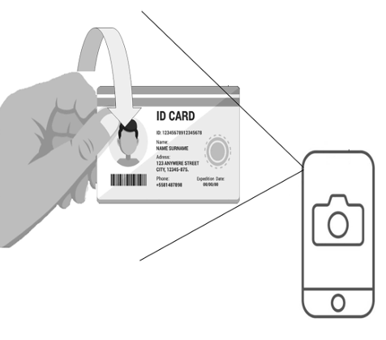
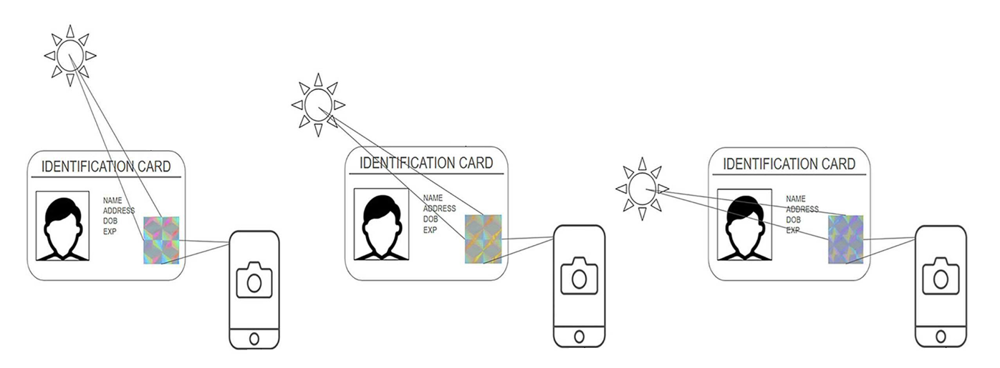
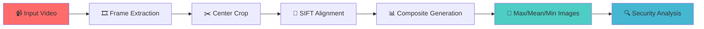
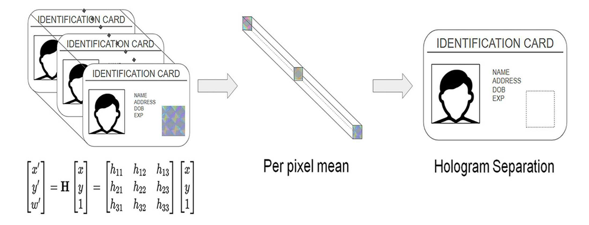
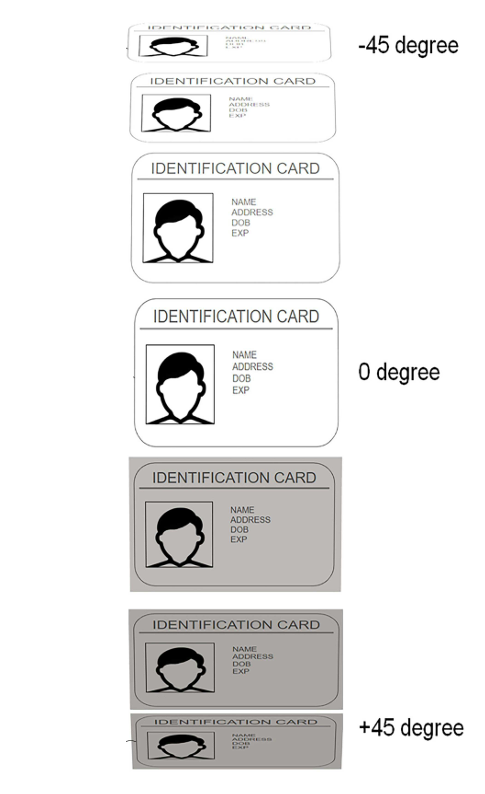
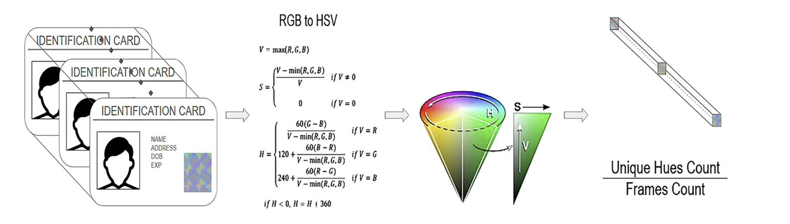

<div align="center">

# 🔮 Hologram Separation Toolkit

### *Advanced ID Card Video Analysis & Security Feature Detection*



[](https://www.python.org/)
[](https://opencv.org/)
[](https://github.com/ultralytics/yolov5)
[](LICENSE)

**Transform handheld video of ID cards into aligned image stacks to reveal hidden security features, holograms, and microprinting through advanced computer vision techniques.**

[Features](#-features) • [Installation](#-installation) • [Quick Start](#-quick-start) • [Documentation](#-documentation) • [Examples](#-examples)

---

</div>

## 🎯 What is This?

This toolkit analyzes ID card videos frame-by-frame to detect and visualize security features that are often invisible to the naked eye. By extracting, aligning, and compositing multiple frames, it reveals:

- 🌈 **Holographic elements** through composite imaging
- 🔍 **Microprinting patterns** via edge detection
- ✨ **Specular highlights** indicating reflective security features
- 📊 **Color variance** showing optically variable inks (OVI)

<div align="center">

</div>

---

## ✨ Features

| Feature | Description |
|---------|-------------|
| 🎥 **Frame Extraction** | Smart extraction of high-quality frames using Laplacian variance |
| 🧭 **SIFT Alignment** | Precise image alignment using SIFT feature matching + RANSAC |
| 🤖 **AI Detection** | YOLOv5-Seg powered ID card detection and segmentation |
| 📐 **Perspective Correction** | Automatic quadrilateral detection and rectification |
| 🎨 **Composite Generation** | Max/Mean/Min image stacks reveal hidden features |
| 📈 **Metric Analysis** | Color histograms, edge detection, specularity indexing |

---

## 🔄 Processing Pipeline



<div align="center">

</div>

---

## 📂 Project Structure

```
Hologram_seperation/
├── main.py                 # Core processing pipeline
├── detection/              # AI-powered detection tools
│   ├── demo.py            # YOLOv5 ID card detection
│   └── README.md          # Detection documentation
├── analysis/               # Image analysis & metrics
│   ├── check.py           # Color, edge, specularity analysis
│   └── README.md          # Analysis documentation
└── images/                 # Project documentation images
    ├── 1.png              # RGB to HSV conversion
    ├── 2.png              # Alignment & separation
    ├── 3.png              # Multi-angle capture
    ├── 4.png              # Perspective variations
    └── 5.png              # Practical use case
```

---

## 📦 Installation

### Prerequisites

- Python 3.8 or higher
- Webcam or video file of an ID card

### Setup

```bash
# Clone the repository
git clone https://github.com/comb0601/Hologram_seperation.git
cd Hologram_seperation

# Create virtual environment
python -m venv .venv
source .venv/bin/activate  # Windows: .venv\Scripts\activate

# Install dependencies
pip install opencv-python opencv-contrib-python onnxruntime numpy torch torchvision scikit-image
```

> ⚠️ **Important:** Install `opencv-contrib-python` for SIFT support. Standard `opencv-python` lacks this feature!

---

## 🚀 Quick Start

### Method 1: Basic Pipeline (`main.py`)

Place your video file (e.g., `print_video.mp4`) in the project directory and run:

```bash
python main.py
```

**The script will:**
1. ✅ Extract sharp frames → `./frames/`
2. ✅ Generate edge previews → `./edge/`
3. ✅ Crop center region → `./cropped_images/`
4. ✅ Align all frames → `./aligned_images/`
5. ✅ Create composites → `./output/`

<div align="center">

| Angle Variations | HSV Color Analysis | Hologram Separation |
|------------------|--------------------|--------------------|
|  |  |  |

</div>

### Method 2: AI-Powered Detection (`detection/demo.py`)

For automatic ID card detection and perspective correction:

```bash
python detection/demo.py -d yolov5x-seg-id-dr-pp-best.onnx -c yolov5
```

**Features:**
- 🎯 YOLOv5 segmentation model
- 🔲 Automatic corner detection
- 📐 Perspective transformation
- 🖼️ Rectified output images

📚 [View detailed detection documentation →](detection/README.md)

---

## 📚 Documentation

### 🎬 Script: `main.py`

**Core Functions:**

| Function | Parameters | Description |
|----------|------------|-------------|
| `save_high_quality_frames()` | `video_path, quality_threshold=100` | Extracts frames above sharpness threshold |
| `find_and_save_edges()` | `input_folder, output_folder` | Generates Canny edge detection previews |
| `crop_center_and_save()` | `input_folder, output_folder, height=400` | Crops horizontal band from center |
| `align_images()` | `input_folder, output_folder` | SIFT + FLANN + Homography alignment |
| `generate_max_mean_min_images()` | `input_folder, output_folder` | Creates composite images |

**Pipeline Example:**
```python
save_high_quality_frames('print_video.mp4', quality_threshold=100, save_folder='frames')
find_and_save_edges('./frames', './edge')
crop_center_and_save('frames', 'cropped_images')
align_images('cropped_images', 'aligned_images')
generate_max_mean_min_images('aligned_images', 'output')
```

---

### 🤖 Script: `detection/demo.py`

**AI-Powered Detection Workflow:**

- **Backend:** ONNX Runtime (CPU/GPU)
- **Model:** YOLOv5-Seg for instance segmentation
- **NMS:** Torchvision non-maximum suppression
- **Corner Detection:** Morphological operations + contour approximation
- **Rectification:** Perspective transform to standard ID dimensions

```bash
# Run detection pipeline
python detection/demo.py -d yolov5x-seg-id-dr-pp-best.onnx -c yolov5
```

📚 [View detailed detection documentation →](detection/README.md)

<div align="center">

</div>

---

### 📊 Script: `analysis/check.py`

**Image Metrics & Analysis:**

Analyzes security features through quantitative metrics:

| Metric | Purpose |
|--------|---------|
| **Color Histogram** | RGB distribution analysis |
| **Sobel Edge Stats** | Microprinting detection |
| **Specularity Index** | Reflective feature measurement |
| **Contrast Ratio** | Highlight vs. base material contrast |

```python
from analysis.check import color_metrics, edge_metrics, specularity_index

# Analyze your composite images
color_stats = color_metrics(image)
edge_stats = edge_metrics(image)
spec_index = specularity_index(image)
```

📚 [View detailed analysis documentation →](analysis/README.md)

---

## 🖼️ Examples

### Visual Output Comparison

<div align="center">

| RGB to HSV Conversion | Per-Pixel Processing | Multi-Angle Capture |
|-----------------------|----------------------|---------------------|
| Unique hue counting for hologram detection | Mean calculation & alignment matrix | Light angle variation reveals features |
|  |  |  |

</div>

### Edge Detection

<div align="center">


*HSV color space conversion enables unique hue counting for hologram detection*
</div>

---

## 🛠️ Troubleshooting

| Issue | Solution |
|-------|----------|
| ❌ SIFT not found | Install `opencv-contrib-python` |
| ⚠️ Poor alignment | Increase texture, adjust RANSAC threshold |
| 📉 Too few frames | Lower `quality_threshold` to 60-80 |
| 💾 Memory issues | Downscale frames or limit input set |

---

## 🗺️ Roadmap

- [ ] CUDA/TensorRT support for GPU acceleration
- [ ] CLI flags for all parameters
- [ ] Batch processing for multiple videos
- [ ] Real-time webcam analysis mode
- [ ] Web dashboard for results visualization
- [ ] Support for additional security features (UV, IR)

---

## 🎓 Use Cases

- 🏛️ **Forensic Analysis** - Law enforcement document verification
- 🏢 **Border Control** - ID authenticity validation
- 🔬 **Research** - Security feature development
- 🎯 **Quality Control** - ID manufacturing verification
- 📚 **Education** - Computer vision demonstrations

<div align="center">

</div>

---

## 📄 License

This project is licensed under the MIT License - see the [LICENSE](LICENSE) file for details.

---

## 🙏 Acknowledgments

- **OpenCV** - Computer vision foundation
- **YOLOv5** - Object detection framework
- **ONNX Runtime** - Cross-platform inference
- **SIFT Algorithm** - Feature detection pioneer work

---

<div align="center">

### 🌟 Star this repo if you find it useful!

**Made with ❤️ for document security and computer vision**

</div>
